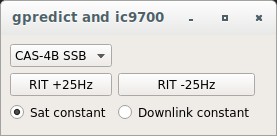
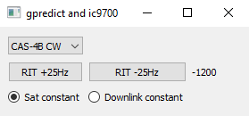
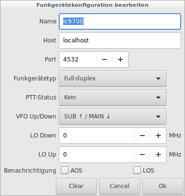
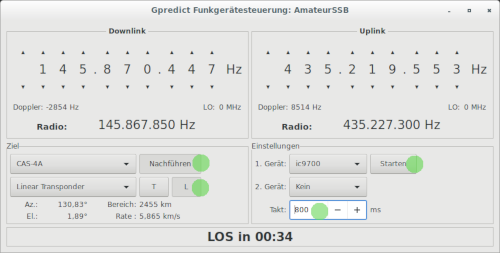

Author  : Andreas Puschendorf, DL7OAP
          Alex Krist, KR1ST
Date    : 2020-11-01

# General

This Pythonscript is plugged between [gpredict](http://gpredict.oz9aec.net/ "Gpredict") and 
[ICOM 9700](https://www.icomeurope.com/produkt/ic-9700/) or [ICOM 9100](https://www.icomeurope.com/produkt/ic-9100/).
It is listing on port 4532 for gpredict UDP packages and frequencies
and it is sending frequencies and startsequences as CAT CI-V commands for ic9700/ic9100 to the serial port.

The main reason for this plugin or adapter is to have a smooth control of the 
ic9700/ic9100 for linear ssb satellites with gpredict (without to have to use hamlib).

This script is not using the satellit mode of the transceiver. It uses the main band as uplink and 
the sub band as downlink. so the internal doppler effect correction can not disturb the work of gpredict. 
 
You can using the dail knob to sweep over the satellite transponder.
The script updates the frequencies not by time intervall, but when a specified hertz offset is reached.
This helps to avoid unnecessary updates and smooth the handling. 
You can easily store your RIT for every satellite for USB/CW, so most of the time when you start on a ssb satellite 
you will here you exactly where you want to be. 

This script does not control the RIT of the ICOM Transceiver, but it uses i virtual RIT which is added
direct to the downlink frequence. This script will, adjust the main and sub VFO frequency for the 
offset read from the satellites.txt file. By applying the frequency offset to the main and sub VFO's you 
will still be able to use the RIT on the radio when needed.

This script also adds support for up to three Gqrx instances to act as panadapters, or to use as separate receivers. 
The frequencies that the Gqrx instances are tuned to are in sync with the radio main and sub VFO's. 
The Gqrx ports that this script will send frequency information to are defined by PORT_GQRX_VHF, PORT_GQRX_UHF, and
PORT_GQRX_SHF.

# Requirements

* Linux or Windows 10 (tested with Win10, Ubuntu 18.04, Raspberry Pi 4B)
* gpredict version 2.3.* (older should also possible)
* python 3.7 (python 2.* will not work)
* python modul pyserial and PyQt5

# Installation

- download sourcecode as zip-file https://github.com/dl7oap/gp2icom/archive/master.zip
- extract it to a folder of your choice
- ensure that python 3.6 or higher is installed <code>python --version</code>
- ensure that pyserial and pyqt5 is installed <code>pip install pyserial</code> and <code>pip install PyQt5</code>
- open gp2icom.py in a text editor, find the following line near the end <code>icomTrx = icom.icom('/dev/ic9700a', '115200', 162)</code> 
and replace /dev/ic9700a with your serial connection port. Example: 'COM5' on Windows or '/dev/ttyUSB0' on Linux.
- 162 is the CI-V adress (hex A2), for IC9100 use 124 (hex 7C)
- start the script with <code>python gp2icom.py</code> or <code>python gp2icom.py -debug</code>

GUI:

Linux 
 and 
Windows 10 

# Configuration in gpredict

<i>Hint: It doesn't matter for this script if VFO Up/Down is set to SUB/MAIN or MAIN/SUB. Both option will work.</i>

# Configuration in gqrx

* Set the port in menu "Tools > Remote control settings > Listen on port" 
    use one of the default ports in this script VHF = 7300, UHF = 7301, SHF = 7302
* activate remote control via menu "Tools > Remote control"

# Configuration ICOM 9700

* CI-V Transceive = ON
* CI-V USB Baud Rate = 115200
* CI-V USB Echo Back = OFF

# Configuration ICOM 9100

* CI-V Transceive = ON
* CI-V USB Baud Rate = 19200
* CI-V USB Echo Back = OFF

# Format of satellites.txt

comma-delimited text file

satellite_description,RIT_frequency,satellite_mode

Example:

CAS-4A,SSB,-500,U/V  
CAS-4A,CW,-1150,U/V  
EO-88,SSB,-30,U/V  
AO-7,SSB,0,U/V  
AO-91,FM,0,U/V  
ISS,FM,0,V/V  

Hint: the script can handle L=23cm, U=70cm, V=2m

# Start the programm

Start the programm by typing this command into the shell 

<code>python gp2icom.py</code>  
or   
<code>python3 gp2icom.py</code>

1. select a satellite
2. start gpredict with a duplex trx on port 4532 and MAIN/SUB tracking a satellite
3. optional: editing the satellites.txt with your needs

# Hints

Update rate in gpredict:
- For SIMPLEX and FM satellites i use an update rate of 10 seconds in gpredict. This is more then enough for FM.
- For SSB/CW i use an update rate between 250ms and 800ms. So cw signals will be ok with 500ms.
- A update rate in SSB/CW greater then 2000ms will correct the uplink late when you are sweeping over the transponder 
via the dial knob.

The pythonscript will only send necessary updates, to calm down the display and reduce load on the CAT interface. 
Only frequency shift greater then a defined Hz will be send to the transceiver.
Search in the file gp2ic9700.py for <code>FREQUENCY_OFFSET_UPLINK = </code> or <code>FREQUENCY_OFFSET_DOWNLINK =</code> 
when you want to change the offset.

At start the script always set:
* with SSB the uplink in LSB and the downlink in USB. Most common satellites should work with this
* with FM subtone 67 Hz will be activated on uplink
* using CW the uplink is mode CW and the downlink will be USB
* the script try to turn of repeater shifts (DUP+, DUP-)
* the script try to turn of the transceiver RIT